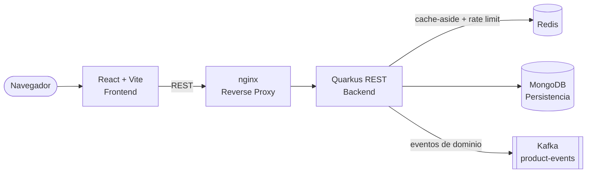

[](https://github.com/apchavez/quarkus-react/actions/workflows/ci.yml)
[](https://sonarcloud.io/summary/new_code?id=apchavez_quarkus-react)
[](https://sonarcloud.io/summary/new_code?id=apchavez_quarkus-react)
[](https://sonarcloud.io/summary/new_code?id=apchavez_quarkus-react)

# Plataforma de Gestión de Productos

Aplicación fullstack de administración de productos construida como proyecto de portafolio para demostrar desarrollo de punta a punta: API REST en Java 21 con arquitectura hexagonal, frontend en React, y un despliegue completo en Kubernetes.

---

## Stack Tecnológico

| Capa | Tecnología |
|---|---|
| Backend | Java 21 · Quarkus 3 · MongoDB · Redis (caché + rate limiting) · Kafka (SmallRye Reactive Messaging) · MapStruct · Lombok · Testcontainers · Apache PDFBox / Apache POI (reportes) · Apache Commons CSV (bulk import) |
| Frontend | React 18 · TypeScript · Vite · Material UI |
| Infraestructura | Docker · Kubernetes · GitHub Actions |

---

## Arquitectura



El backend sigue **Arquitectura Hexagonal (Ports & Adapters)**:

- **Capa de dominio** — Entidad Product, eventos de dominio (`ProductEvent`/`ProductEventType`), y contratos de puertos (interfaces de repositorio/publicador de eventos)
- **Capa de aplicación** — Casos de uso para operaciones CRUD, publicando un evento de dominio tras cada creación/actualización/eliminación
- **Capa de infraestructura** — Adaptador de MongoDB, adaptador de caché Redis + filtro de rate limiting, publicador de eventos Kafka, controlador REST

El frontend es una aplicación de una sola página (SPA) construida con React + Vite, que se comunica con el backend a través de una API REST.

Ambos servicios están containerizados de forma independiente y orquestados vía Kubernetes o Docker Compose.

---

## Estructura del Repositorio

```text
product-management/
├── api/         Backend Java + Quarkus
│   ├── src/
│   ├── Dockerfile
│   └── build.gradle
├── web/         Frontend React + Vite
│   ├── src/
│   ├── Dockerfile
│   └── nginx.conf
├── chart/                           Helm chart — los manifiestos que realmente se despliegan (deploy.yml)
│   ├── Chart.yaml, values.yaml
│   └── templates/                  Deployments, services, ingress, mongo, redis, kafka, issuer,
│                                    PrometheusRule, Grafana, NetworkPolicy, PDB
├── terraform/                       Clúster EKS + VPC sobre el que se despliega el chart anterior — ver terraform/README.md
├── docker/
│   ├── gateway.conf                 gateway nginx (Docker Compose)
│   ├── kafka-client.properties      Config del cliente SASL para el healthcheck de Kafka (Docker Compose)
│   ├── prometheus.yml               Config de scraping de Prometheus (Docker Compose)
│   └── grafana/                     Provisioning de datasource + dashboard (Docker Compose)
├── postman/
│   ├── quarkus-react.postman_collection.json
│   ├── quarkus-react.local.postman_environment.json
│   └── quarkus-react.k8s.postman_environment.json
├── .github/workflows/
│   └── ci.yml                      Tests + build y publicación de imágenes Docker (backend y frontend)
├── docker-compose.yml
└── README.md
```

---

## Cómo Empezar

### Docker Compose (recomendado para desarrollo local)

```bash
docker compose up --build
```

- App (frontend + API, vía el reverse proxy `gateway`): `http://localhost`
- Prometheus: `http://localhost:9090`
- Grafana: `http://localhost:3000` (acceso anónimo de solo lectura, con el dashboard de Product API pre-provisionado)

### Kubernetes

```bash
helm upgrade --install product-management ./chart --namespace product-management --create-namespace
```

Agregar `product.local` a `/etc/hosts` apuntando a la IP de tu Ingress controller, luego acceder a la app en `http://product.local`.

Asume que ya existe un clúster con `ingress-nginx`, `cert-manager`, y un `StorageClass` por defecto respaldado por EBS. No se provisiona ningún clúster por defecto — ver [`terraform/README.md`](terraform/README.md) para levantar uno en EKS (nota: esto crea recursos reales y facturables de AWS).

---

## Testing

```bash
# Backend
cd api
./gradlew test

# Tests unitarios del frontend
cd web
pnpm test

# Tests E2E del frontend (Playwright)
cd web
pnpm test:e2e
```

Ambos servicios tienen suites de tests independientes. El backend cubre casos de uso, adaptadores de persistencia y endpoints REST. Los tests de integración usan **Testcontainers** con una instancia real de MongoDB 7.0 — se requiere Docker para correrlos.

Ver [`api/README.md`](api/README.md) para el detalle completo de cobertura y descripción de los tests.

**E2E del frontend (Playwright):** `web/e2e/products.spec.ts` cubre carga de página, crear, editar, eliminar y flujos de validación de formulario. Todas las llamadas a la API están mockeadas con `page.route()` — no se necesita backend para correr los tests.

---

## CI/CD

GitHub Actions corre los tests, publica imágenes Docker en GHCR, y despliega en Kubernetes:

| Workflow | Trigger | Qué hace |
|---|---|---|
| `ci.yml` | Cada push / PR a `main` | Tests del backend + gate de cobertura JaCoCo; typecheck, tests y cobertura del frontend; E2E con Playwright; fmt/validate de Terraform; SonarCloud (en main); (solo push a `main`) construye y publica `ghcr.io/apchavez/product-api:latest`/`:sha-<SHA>` y `ghcr.io/apchavez/product-web:latest`/`:sha-<SHA>` |
| `deploy.yml` | Manual (`workflow_dispatch`) | `helm upgrade --install product-management ./chart --set api.image.tag=latest --set web.image.tag=latest` → verifica el rollout de `product-api` y `product-web` |
| `destroy.yml` | Manual (`workflow_dispatch`) | Elimina el namespace `product-management` y todos sus recursos |
| `k6.yml` | Manual (`workflow_dispatch`) | Corre `k6/product-api.js` contra `K6_BASE_URL` con el escenario elegido (`smoke`/`load`/`spike`) |

### Flujo de deploy

`deploy.yml` es solo manual — no hay un clúster en vivo detrás de este proyecto de portafolio, así que dispararlo automáticamente después de cada docker-publish solo fallaría por falta de `KUBECONFIG`/secretos. Desplegar explícitamente cuando tengas un clúster real como destino, y usar `destroy.yml` para eliminarlo cuando ya no se necesite:

```bash
gh workflow run deploy.yml
gh workflow run destroy.yml -f namespace=product-management -f confirm=destroy
```

**Secreto requerido:** `KUBECONFIG` — contenido del archivo kubeconfig, configurado en el entorno `production` de GitHub.

---

## Observabilidad

| Señal | Endpoint | Notas |
|---|---|---|
| Métricas | `/api/v1/q/metrics` | Formato Micrometer + Prometheus |
| Health (liveness) | `/api/v1/q/health/live` | SmallRye Health |
| Health (readiness) | `/api/v1/q/health/ready` | Hace ping a MongoDB con timeout de 2s |
| Caché | `product-cache`, `products-search-cache` (Redis, TTL 5 min) | Cache-aside; se invalida en escrituras; fail-open si Redis no está disponible |
| Trazas | OTLP gRPC `$OTEL_EXPORTER_OTLP_ENDPOINT` | Auto-instrumentación de OpenTelemetry |
| Logs | stdout | JSON (estilo ECS) en el perfil `prod` vía `quarkus-logging-json`; legible para humanos en `dev` |

### Logging JSON estructurado

En el perfil `prod`, los logs se emiten como JSON estructurado a stdout — listo para Loki, Fluentd, o cualquier agregador de logs corriendo como sidecar en Kubernetes.

```json
{
  "timestamp": "2024-06-30T10:15:30.123Z",
  "level": "INFO",
  "loggerName": "com.products.adapters.in.rest.ProductResource",
  "message": "Creating product with SKU PROD-001",
  "mdc": {
    "traceId": "4bf92f3577b34da6a3ce929d0e0e4736",
    "spanId": "00f067aa0ba902b7"
  },
  "threadName": "executor-thread-1"
}
```

`traceId` y `spanId` se inyectan automáticamente en el MDC por la extensión `quarkus-opentelemetry`. En modo `dev` se usa el formato de consola estándar, legible para humanos.

### Alertas

`chart/templates/prometheus-rule.yaml` define un `PrometheusRule` (requiere [Prometheus Operator](https://prometheus-operator.dev)) con tres reglas:

| Alerta | Condición | Severidad |
|---|---|---|
| `HighErrorRate` | >5% de las peticiones devuelven 5xx durante 2 min | crítica |
| `HighP99Latency` | Latencia P99 >1s durante 2 min | advertencia |
| `PodNotReady` | Cualquier pod no listo durante 2 min | crítica |

### Grafana

`chart/templates/grafana.yaml` despliega Grafana 11.1 con un datasource de Prometheus pre-provisionado y un dashboard que cubre tasa de peticiones, tasa de error, latencia P50/P99, y memoria de la JVM. Acceder localmente con:

```bash
kubectl port-forward svc/grafana 3000:3000
```

Luego abrir `http://localhost:3000` (acceso anónimo de solo lectura, sin necesidad de login).

El mismo par Prometheus + Grafana también está disponible sin un clúster vía `docker compose up --build` (ver [Cómo Empezar](#cómo-empezar)) — `docker/prometheus.yml` y `docker/grafana/` replican la config de scraping, el datasource y el dashboard del chart de Helm para iteración local.

---

## Postman

La carpeta `postman/` contiene la colección y dos entornos.

| Archivo | Descripción |
|---|---|
| `quarkus-react.postman_collection.json` | Colección principal (15 requests) |
| `quarkus-react.local.postman_environment.json` | Entorno local vía Docker Compose |
| `quarkus-react.k8s.postman_environment.json` | Entorno Kubernetes (`product.local`) |

Importar los tres archivos en Postman, seleccionar el entorno correspondiente, y correr los requests en orden — `00 - Login` captura un JWT automáticamente y lo aplica como Bearer auth de la colección para cada request siguiente; `01 - Create Product` captura `productId` para requests posteriores. `08 - Import Products (CSV)` requiere adjuntar manualmente un archivo en el campo `file` (form-data) antes de ejecutar. `09`/`10` descargan el reporte de productos en PDF/Excel. Los endpoints de health/métricas (`12`-`15`) están marcados como `noauth` ya que no requieren token.

> Para K8s: agregar `product.local` a `/etc/hosts` apuntando a la IP del Ingress controller antes de correr la colección.

---

## OpenAPI

La documentación se autogenera al arrancar a partir de las anotaciones de MicroProfile OpenAPI (extensión `quarkus-smallrye-openapi`).

| Endpoint | URL | Notas |
|---|---|---|
| Swagger UI | `http://localhost:8080/api/v1/q/swagger-ui` | Solo en modo dev |
| Spec OpenAPI | `http://localhost:8080/api/v1/q/openapi` | Siempre disponible |

El Swagger UI está habilitado solo en modo dev (`%dev.quarkus.swagger-ui.enable=true`). Para probar endpoints protegidos desde la UI, hacer click en **Authorize** e ingresar `Bearer <token>`. Todos los endpoints requieren el esquema `BearerAuth`. Roles: `ADMIN` (acceso de escritura), `USER` (solo lectura).

**Obtener un token:** `POST /api/v1/auth/login` con `{"username": "...", "password": "..."}` devuelve un JWT firmado. Usuarios demo: `admin`/`admin123` (ADMIN + USER) y `user`/`user123` (solo USER) — ver `DemoUserStore.java`. El frontend en React (`web/`) tiene una página de login en `/login` que llama a este endpoint, guarda el token, y lo adjunta como header Bearer en cada petición a la API; redirige automáticamente a `/login` ante un 401.

**Clave de firma:** no hay ningún par de claves RSA commiteado en el repo. `EphemeralJwtKeyConfigSource` (`api/src/main/java/com/products/infrastructure/auth/`) genera un par de claves RSA-2048 nuevo en memoria al arrancar, y lo expone como `smallrye.jwt.sign.key`/`mp.jwt.verify.publickey` — se usa automáticamente para desarrollo local, tests y CI, sin necesidad de configuración. Es solo un fallback (ordinal de configuración bajo): si `SMALLRYE_JWT_SIGN_KEY`/`MP_JWT_VERIFY_PUBLICKEY` están definidos de otra forma, esos ganan. En un deploy real con Helm, `chart/templates/jwt-keys-job.yaml` (un hook Job `pre-install,pre-upgrade`) genera un par de claves una sola vez y lo guarda en un Secret `jwt-keys` si no existe ya uno, de modo que todas las réplicas de la API comparten la misma clave — una clave efímera por pod rompería la verificación de tokens entre réplicas.

**Iniciar en modo dev:**

```bash
cd api
./gradlew quarkusDev
# Swagger UI → http://localhost:8080/api/v1/q/swagger-ui
```

---

## Qué Demuestra Este Proyecto

- Desarrollo fullstack: backend Java + frontend React como servicios independientes
- Arquitectura hexagonal sobre Quarkus con persistencia en MongoDB y una capa cache-aside real con Redis (compartida entre réplicas, fail-open ante caídas de Redis)
- Eventos de dominio publicados a Kafka (`product-events`) tras cada creación/actualización/eliminación, fire-and-forget vía SmallRye Reactive Messaging — replica el patrón event-driven usado en el proyecto hermano [spring-webflux-angular](https://github.com/apchavez/spring-webflux-angular)
- Rate limiting de ventana fija respaldado por Redis (100 req/60s por IP) en los endpoints de escritura de productos, fail-open ante caídas de Redis
- Bulk import de productos vía CSV (`POST /products/import`) con validación fila por fila que no aborta el lote completo, y descarga de reportes del catálogo en PDF (Apache PDFBox) y Excel (Apache POI, streaming vía `SXSSFWorkbook`)
- Manifiestos completos de Kubernetes: ConfigMap, Secret, Deployments, Services, Ingress
- Builds Docker multi-stage para backend y frontend
- Pipelines de CI/CD independientes por servicio (backend y frontend publicados por separado en GHCR)
- Stack de observabilidad completo: métricas de Prometheus, trazado con OpenTelemetry, health checks de SmallRye, alertas con PrometheusRule, y dashboard de Grafana
- Infraestructura como Código: Terraform provisiona el clúster EKS, la VPC, el driver EBS CSI, ingress-nginx, y cert-manager sobre los que se despliega el chart de Helm (ver [`terraform/README.md`](terraform/README.md))

---

## Documentación Detallada

Ver [`api/README.md`](api/README.md) para la configuración completa del backend, endpoints, e instrucciones de deployment.

---

## Proyectos Relacionados

Este repo hace pareja con **spring-webflux-angular**, **spring-mvc-angular**, y **net-vue**: los cuatro implementan el mismo dominio de Gestión de Productos (sku/name/description/category/price/stock/active), los mismos 11 endpoints REST (crear, actualizar, eliminar, buscar por ID, buscar por SKU, buscar por prefijo de nombre, listar activos — paginado y cacheado, listar inactivos — paginado, bulk import vía CSV, descargar reporte PDF, descargar reporte Excel), el mismo tópico Kafka `product-events` y las mismas reglas de rate limiting con Redis, distinto stack de backend/frontend — mantenidos en paridad funcional a propósito. El trío serverless de agendamiento de citas forma un segundo grupo así, compartiendo ese dominio en su lugar.

| Proyecto | Descripción |
|---|---|
| [spring-webflux-angular](https://github.com/apchavez/spring-webflux-angular) | Mismo dominio de Gestión de Productos que este repo, backend reactivo con Spring Boot WebFlux, frontend Angular, PostgreSQL, Redis, Kafka, despliegue en Kubernetes |
| [spring-mvc-angular](https://github.com/apchavez/spring-mvc-angular) | Mismo dominio de Gestión de Productos y frontend Angular que spring-webflux-angular, backend clásico bloqueante con Spring MVC, Spring Data JDBC, Kafka, Kubernetes |
| [net-vue](https://github.com/apchavez/net-vue) | Mismo dominio de Gestión de Productos que este repo, backend ASP.NET Core, frontend Vue 3, PostgreSQL, Kafka, Kubernetes |
| [aws-typescript](https://github.com/apchavez/aws-typescript) | Plataforma de Agendamiento de Citas Médicas — TypeScript, AWS Lambda, DynamoDB, SNS/SQS |
| [azure-python](https://github.com/apchavez/azure-python) | Mismo dominio de agendamiento de citas que arriba, reescrito en Python sobre Azure Functions con Clean Architecture |
| [gcp-go](https://github.com/apchavez/gcp-go) | Mismo dominio de agendamiento de citas que arriba, escrito en Go sobre GCP Cloud Run con Clean Architecture |
---

## Licencia

[MIT](LICENSE)
