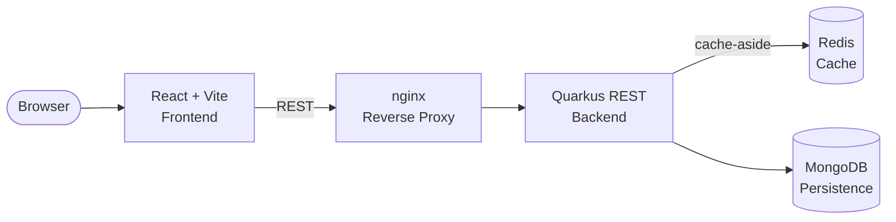

[](https://github.com/apchavez/quarkus-react-fullstack-k8s/actions/workflows/ci.yml)
[](https://sonarcloud.io/summary/new_code?id=apchavez_quarkus-react-fullstack-k8s)
[](https://sonarcloud.io/summary/new_code?id=apchavez_quarkus-react-fullstack-k8s)
[](https://sonarcloud.io/summary/new_code?id=apchavez_quarkus-react-fullstack-k8s)

# Product Management Platform

Fullstack application for product administration built as a portfolio project to demonstrate end-to-end development: Java 21 REST API with hexagonal architecture, React frontend, and a complete Kubernetes deployment.

---

## Tech Stack

| Layer | Technology |
|---|---|
| Backend | Java 21 · Quarkus 3 · MongoDB · Redis · MapStruct · Lombok · Testcontainers |
| Frontend | React 18 · TypeScript · Vite · Material UI |
| Infrastructure | Docker · Kubernetes · GitHub Actions |

---

## Architecture



The backend follows **Hexagonal Architecture (Ports & Adapters)**:

- **Domain layer** — Product entity and port contracts (repository interfaces)
- **Application layer** — Use cases for CRUD operations
- **Infrastructure layer** — MongoDB adapter, Redis cache adapter, REST controller

The frontend is a single-page application built with React + Vite, communicating with the backend through a REST API.

Both services are independently containerized and orchestrated via Kubernetes or Docker Compose.

---

## Repository Structure

```text
product-management/
├── api/         Java + Quarkus backend
│   ├── src/
│   ├── Dockerfile
│   └── build.gradle
├── web/         React + Vite frontend
│   ├── src/
│   ├── Dockerfile
│   └── nginx.conf
├── chart/                           Helm chart — the manifests actually deployed (deploy.yml)
│   ├── Chart.yaml, values.yaml
│   └── templates/                  Deployments, services, ingress, mongo, redis, issuer,
│                                    PrometheusRule, Grafana, NetworkPolicy, PDB
├── docker/
│   └── gateway.conf                nginx gateway (Docker Compose)
├── postman/
│   ├── quarkus-react-fullstack-k8s.postman_collection.json
│   ├── quarkus-react-fullstack-k8s.local.postman_environment.json
│   └── quarkus-react-fullstack-k8s.k8s.postman_environment.json
├── .github/workflows/
│   ├── docker-publish.yml          Backend CI/CD
│   └── docker-publish-web.yml      Frontend CI/CD
├── docker-compose.yml
└── README.md
```

---

## Getting Started

### Docker Compose (recommended for local dev)

```bash
docker compose up --build
```

- Backend API: `http://localhost:8080`
- Frontend: `http://localhost:3000`

### Kubernetes

```bash
helm upgrade --install product-management ./chart --namespace product-management --create-namespace
```

Add `product.local` to `/etc/hosts` pointing to your Ingress controller IP, then access the app at `http://product.local`.

---

## Testing

```bash
# Backend
cd api
./gradlew test

# Frontend unit tests
cd web
pnpm test

# Frontend E2E tests (Playwright)
cd web
pnpm test:e2e
```

Both services have independent test suites. The backend covers use cases, persistence adapters, and REST endpoints. Integration tests use **Testcontainers** with a real MongoDB 7.0 instance — Docker is required to run them.

See [`api/README.md`](api/README.md) for full coverage details and test descriptions.

**Frontend E2E (Playwright):** `web/e2e/products.spec.ts` covers page load, create, edit, delete, and form validation flows. All API calls are mocked with `page.route()` — no backend required to run the tests.

---

## CI/CD

GitHub Actions runs tests, publishes Docker images to GHCR, and deploys to Kubernetes:

| Workflow | Trigger | What it does |
|---|---|---|
| `ci.yml` | Every push / PR to `main` | Backend tests + JaCoCo coverage gate; frontend typecheck, tests, and coverage; Playwright E2E; SonarCloud (on main) |
| `docker-publish.yml` | Push / PR to `main` (`api/**`) | Backend tests + coverage → builds and pushes `ghcr.io/apchavez/product-api:latest` and `:sha-<SHA>` |
| `docker-publish-web.yml` | Push / PR to `main` (`web/**`) | Frontend typecheck, tests, coverage → builds and pushes `ghcr.io/apchavez/product-web:latest` and `:sha-<SHA>` |
| `deploy.yml` | Automatic after docker-publish (any service) · Manual via `workflow_dispatch` | `helm upgrade --install product-management ./chart --set api.image.tag=latest --set web.image.tag=latest` → verifies rollout of `product-api` and `product-web` |

### Deploy flow

```
push to main (api/ or web/)
  → docker-publish*.yml  (test → build → push image :latest + :sha-<SHA>)
  → deploy.yml           (helm upgrade ./chart --set *.image.tag=latest → rollout status)
```

**Required secret:** `KUBECONFIG` — kubeconfig file content, configured in the `production` GitHub environment.

To trigger a manual redeploy without a code change:

```bash
gh workflow run deploy.yml
```

---

## Observability

| Signal | Endpoint | Notes |
|---|---|---|
| Metrics | `/api/v1/q/metrics` | Micrometer + Prometheus format |
| Health (liveness) | `/api/v1/q/health/live` | SmallRye Health |
| Health (readiness) | `/api/v1/q/health/ready` | Pings MongoDB and Redis with 2s timeout |
| Traces | OTLP gRPC `$OTEL_EXPORTER_OTLP_ENDPOINT` | OpenTelemetry auto-instrumentation |
| Logs | stdout | JSON (ECS-like) in `prod` profile via `quarkus-logging-json`; human-readable in `dev` |

### Structured JSON logging

In the `prod` profile, logs are emitted as structured JSON to stdout — ready for Loki, Fluentd, or any log aggregator running as a sidecar in Kubernetes.

```json
{
  "timestamp": "2024-06-30T10:15:30.123Z",
  "level": "INFO",
  "loggerName": "com.products.adapters.in.rest.ProductResource",
  "message": "Creating product with SKU PROD-001",
  "mdc": {
    "traceId": "4bf92f3577b34da6a3ce929d0e0e4736",
    "spanId": "00f067aa0ba902b7"
  },
  "threadName": "executor-thread-1"
}
```

`traceId` and `spanId` are injected automatically into MDC by the `quarkus-opentelemetry` extension. In `dev` mode, the standard human-readable console format is used.

### Alerting

`chart/templates/prometheus-rule.yaml` defines a `PrometheusRule` (requires [Prometheus Operator](https://prometheus-operator.dev)) with three rules:

| Alert | Condition | Severity |
|---|---|---|
| `HighErrorRate` | >5% of requests return 5xx for 2 min | critical |
| `HighP99Latency` | P99 latency >1s for 2 min | warning |
| `PodNotReady` | Any pod not ready for 2 min | critical |

### Grafana

`chart/templates/grafana.yaml` deploys Grafana 11.1 with a pre-provisioned Prometheus datasource and a dashboard covering request rate, error rate, P50/P99 latency, and JVM memory. Access it locally with:

```bash
kubectl port-forward svc/grafana 3000:3000
```

Then open `http://localhost:3000` (anonymous viewer access, no login required).

---

## Postman

The `postman/` folder contains the collection and two environments.

| File | Description |
|---|---|
| `quarkus-react-fullstack-k8s.postman_collection.json` | Main collection (12 requests) |
| `quarkus-react-fullstack-k8s.local.postman_environment.json` | Local environment via Docker Compose |
| `quarkus-react-fullstack-k8s.k8s.postman_environment.json` | Kubernetes environment (`product.local`) |

Import all three files into Postman, select the appropriate environment, and run the requests in order — `00 - Login` captures a JWT automatically and applies it as the collection's Bearer auth for every subsequent request; `01 - Create Product` captures `productId` for later requests. Health/metrics endpoints (`08`-`11`) are marked `noauth` since they don't require a token.

> For K8s: add `product.local` to `/etc/hosts` pointing to the Ingress controller IP before running the collection.

---

## OpenAPI

Documentation is auto-generated at startup from MicroProfile OpenAPI annotations (`quarkus-smallrye-openapi` extension).

| Endpoint | URL | Notes |
|---|---|---|
| Swagger UI | `http://localhost:8080/api/v1/q/swagger-ui` | Dev mode only |
| OpenAPI spec | `http://localhost:8080/api/v1/q/openapi` | Always available |

The Swagger UI is enabled in dev mode only (`%dev.quarkus.swagger-ui.enable=true`). To test protected endpoints from the UI, click **Authorize** and enter `Bearer <token>`. All endpoints require the `BearerAuth` scheme. Roles: `ADMIN` (write access), `USER` (read-only).

**Getting a token:** `POST /api/v1/auth/login` with `{"username": "...", "password": "..."}` returns a signed JWT. Demo users: `admin`/`admin123` (ADMIN + USER) and `user`/`user123` (USER only) — see `DemoUserStore.java`. The React frontend (`web/`) has a login page at `/login` that calls this endpoint, stores the token, and attaches it as a Bearer header to every API request; it redirects to `/login` automatically on a 401.

**Start in dev mode:**

```bash
cd api
./gradlew quarkusDev
# Swagger UI → http://localhost:8080/api/v1/q/swagger-ui
```

---

## What This Project Demonstrates

- Fullstack development: Java backend + React frontend as independent services
- Hexagonal architecture on Quarkus with MongoDB persistence and Redis caching
- Complete Kubernetes manifests: ConfigMap, Secret, Deployments, Services, Ingress
- Multi-stage Docker builds for both backend and frontend
- Independent CI/CD pipelines per service (backend and frontend published separately to GHCR)
- Full observability stack: Prometheus metrics, OpenTelemetry tracing, SmallRye health checks, PrometheusRule alerts, and Grafana dashboard

---

## Detailed Documentation

See [`api/README.md`](api/README.md) for complete backend setup, endpoints, and deployment instructions.

---

## Related Projects

| Project | Description |
|---|---|
| [spring-webflux-hexagonal-arch](https://github.com/apchavez/spring-webflux-hexagonal-arch) | Java 21 reactive REST API with Spring Boot WebFlux, hexagonal architecture, PostgreSQL, and Kubernetes deployment |
| [clean-arch-azure-functions-java](https://github.com/apchavez/clean-arch-azure-functions-java) | Java 21 serverless platform on Azure Functions with Clean Architecture |
---

## License

[MIT](LICENSE)
